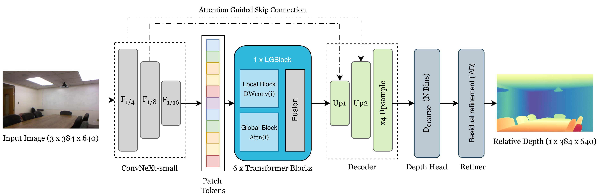

# TDepth: A Lightweight Hybrid Model for Monocular Depth Estimation

**Accepted for publication in IET Computer Vision.**

TDepth is a lightweight hybrid CNN–Transformer model that predicts relative depth from a single RGB image. It combines a ConvNeXt-based feature extractor, a local–global transformer encoder, an attention-guided skip-fusion decoder, and a compact refiner to improve object boundaries and fine details. The model is trained using teacher-generated pseudo-depth labels and balances depth accuracy, computational efficiency, and generalisation to unseen indoor datasets.

## Model Architecture

## Visual Results

The visual results show TDepth predictions on NYU Depth v2 and iBims-1, highlighting scene layout, object boundaries, and fine details.

## Paper

**TDepth: A Lightweight Hybrid Model for Monocular Depth Estimation**  
Muhammad Adeel Hafeez, Ganesh Sistu, Michael G. Madden, and Ihsan Ullah  
Accepted for publication in *IET Computer Vision*.

*Paper link will be added here.*

<!-- Replace PAPER_URL with the paper URL, then uncomment the line below. -->
<!-- [Read the paper](PAPER_URL) -->

## Acknowledgements

We thank the authors of [Pixel-Perfect-Depth](https://github.com/gangweix/pixel-perfect-depth) for releasing their code and pretrained model. We used Pixel-Perfect-Depth as the teacher model to generate the pseudo-depth labels used to train TDepth.
